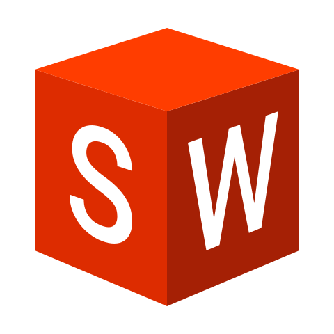

# 💻 Skill
 

## Languages

  
  
  

## Databases

  
  

## Dev Tools

  
  
  
  
  

## Maker stuffs

  
  

### This readme.md was heavily based on my friend [rodrigo2019](https://github.com/rodrigo2019)
